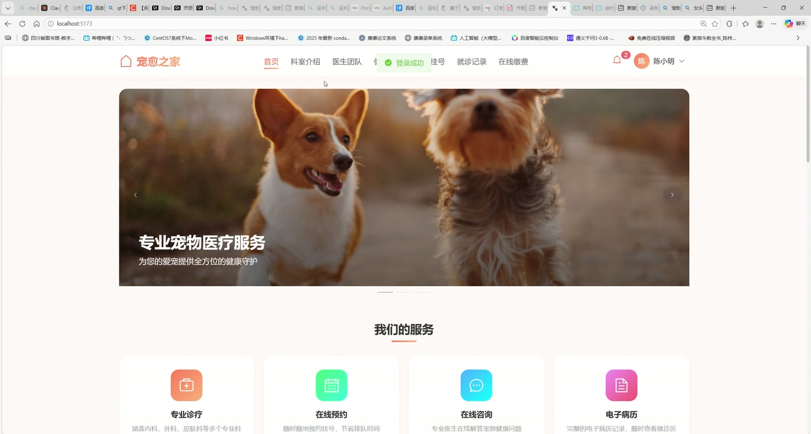
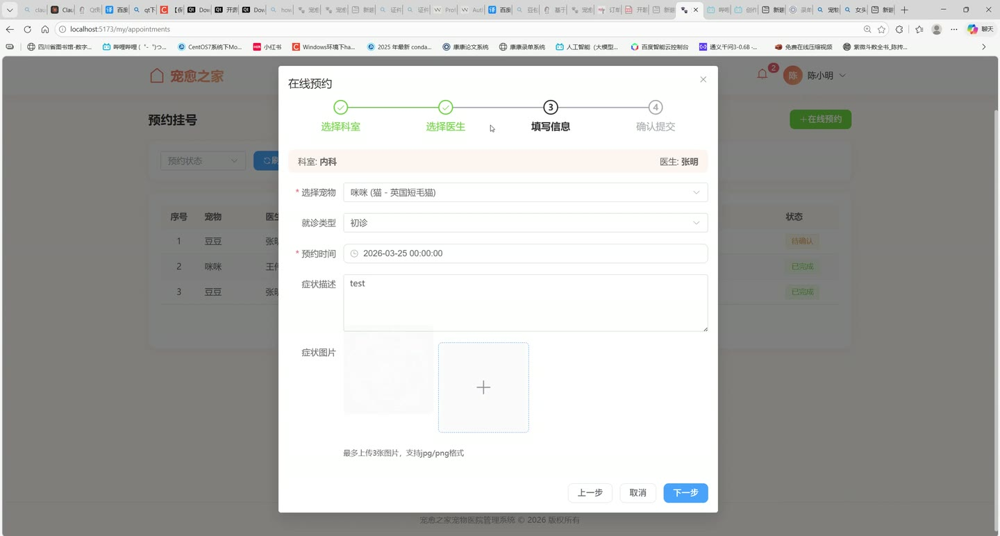
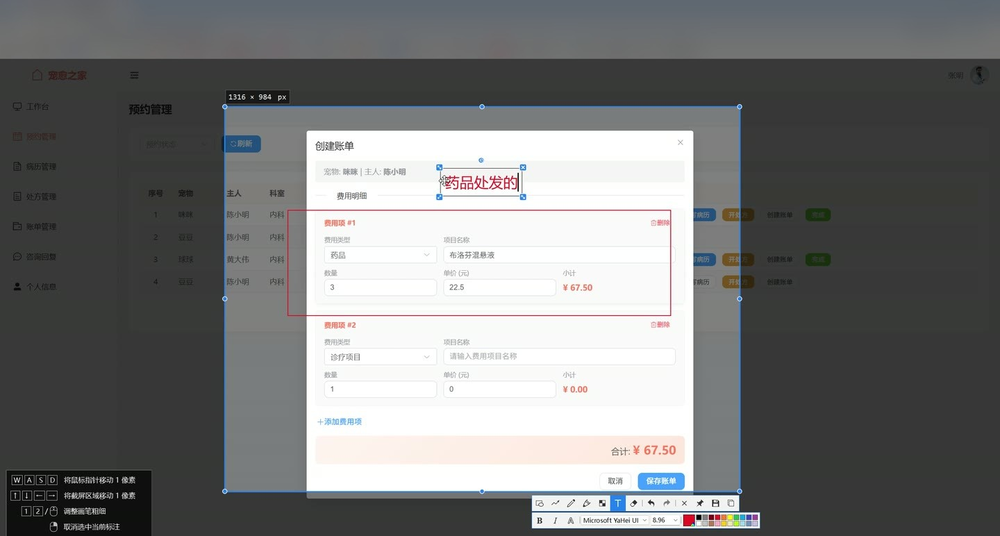
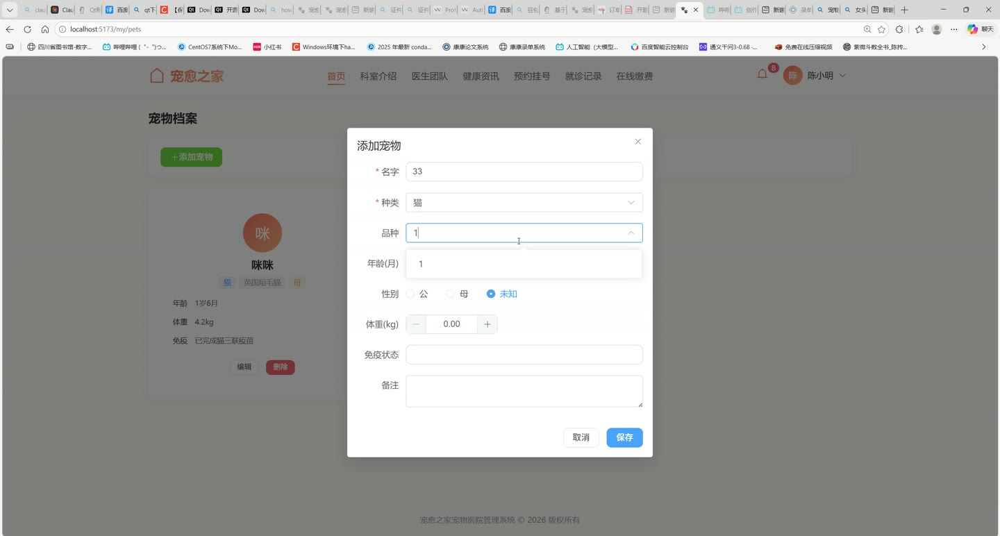
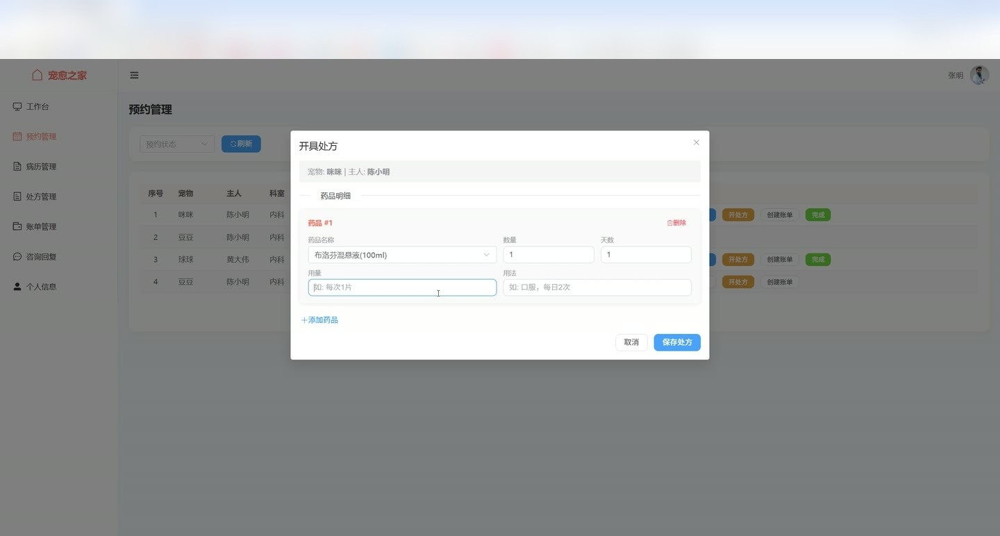
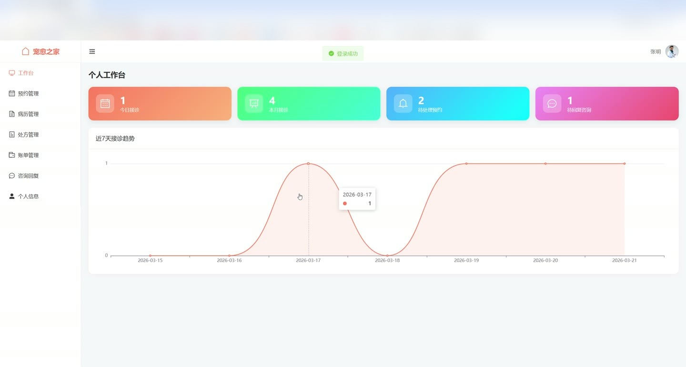

# (附文档)Springboot3+Vue3+MySQL 宠愈之家宠物医院管理系统

**技术栈**：Springboot3、Vue3、MySQL

### 系统简介

宠愈之家宠物医院管理系统是一套基于 Spring Boot 3 + Vue 3 前后端分离架构的综合性管理平台。系统覆盖预约挂号、诊疗管理、药品库存、账单支付、健康资讯等核心业务环节，支持管理员、医生、客户三种角色协同操作，实现宠物医院日常运营的数字化管理。
 
### 核心功能
 
### 管理员端

 
- 用户管理：分页查询系统用户列表，支持按角色/状态/关键词筛选，新增/编辑/启用/禁用用户账号 
- 角色权限：系统内置 ADMIN（管理员）、DOCTOR（医生）、CLIENT（客户）三种角色，不同角色拥有独立操作权限 
- 科室管理：新增/编辑/删除科室，设置科室负责人，分配医生到指定科室 
- 字典管理：维护字典类型（如就诊类型、支付方式等）及字典数据项，支持按编码快速获取数据 
- 药品管理：维护药品信息（名称/规格/库存/单价/预警阈值），查看低库存预警列表 
- 药品出入库：执行药品入库或出库操作，自动更新库存数量并记录操作日志 
- 诊疗项目管理：新增/编辑/删除诊疗项目（名称/价格/所属科室），控制项目上下架状态 
- 健康文章管理：发布/编辑/删除健康科普文章，文章支持标题/内容/封面图/状态管理 
- 系统日志：分页查询操作日志，支持按操作类型/用户名/关键词筛选，记录操作人/IP/方法/参数 
- 数据统计：查看首页概览（今日就诊量/总营收/客户数/医生数/宠物数/待处理预约及咨询） 
- 就诊趋势：展示近 7 天就诊量趋势图表（按日期统计预约数） 
- 营收趋势：展示近 7 天已支付账单营收趋势图表
 
### 医生端

 
- 医生工作台：查看个人今日接诊量、本月接诊量、待处理预约数、待回复咨询数、总病历数 
- 预约管理：查看预约列表（支持按状态/宠物主人/关键词筛选），确认/拒绝/完成预约，自动通知客户状态变更 
- 在线咨询：查看客户提交的咨询列表，回复咨询内容（支持上传图片），关闭已完成的咨询 
- 病历管理：创建/编辑就诊病历（记录诊断/医嘱/检查结果），关联宠物和预约记录，自动通知宠物主人 
- 处方管理：开具处方（选择药品/填写用量/用法/天数），查看处方详情，作废无效处方 
- 账单管理：创建就诊账单（添加多个收费项目，自动计算总金额），查看账单详情及支付状态 
- 个人统计：通过工作台查看个人接诊趋势数据
 
### 客户端

 
- 宠物档案：新增/编辑/删除宠物信息（名称/品种/年龄/性别/体重/毛色），查看个人宠物列表 
- 预约挂号：选择科室和医生，填写症状描述（支持上传图片），提交预约申请，查看预约状态 
- 在线咨询：选择科室和医生，提交咨询问题（支持上传图片），查看医生回复记录 
- 账单查看：查看个人就诊账单列表及详情（含收费明细项），在线支付账单（记录支付方式/支付时间） 
- 病历查看：查看个人宠物的就诊病历详情（诊断/医嘱/检查结果） 
- 通知提醒：接收系统通知（预约状态变更/新病历/账单待支付等），标记已读或一键全部已读 
- 个人信息：查看/编辑个人资料，修改登录密码
 
### 公共前台（无需登录）

 
- 科室展示：查看所有启用的科室列表 
- 医生信息：按科室筛选查看医生列表（含姓名/职称/头像/简介） 
- 健康文章：分页浏览已发布的健康科普文章，查看详情（自动增加浏览量） 
- 诊疗项目：按科室筛选查看已上架的诊疗项目（名称/价格/说明）
 
### 技术栈

 后端框架Spring Boot 3 ORMMyBatis-Plus 权限认证Spring Security 前端框架Vue 3 状态管理Pinia 构建工具Maven 数据库MySQL
 
### 交付内容

 
- 后端完整源码 
- 前端完整源码 
- 数据库初始化脚本 
- 万字文档

## 界面展示

---

## 获取完整源码 + 万字文档

本仓库为项目介绍页。**完整前后端源码、数据库初始化脚本、万字项目文档**，请加微信 `kangkangcode`，或访问 [codekk.top](http://codekk.top) 获取。

可作课程设计 / 毕业设计参考，支持远程部署调试。